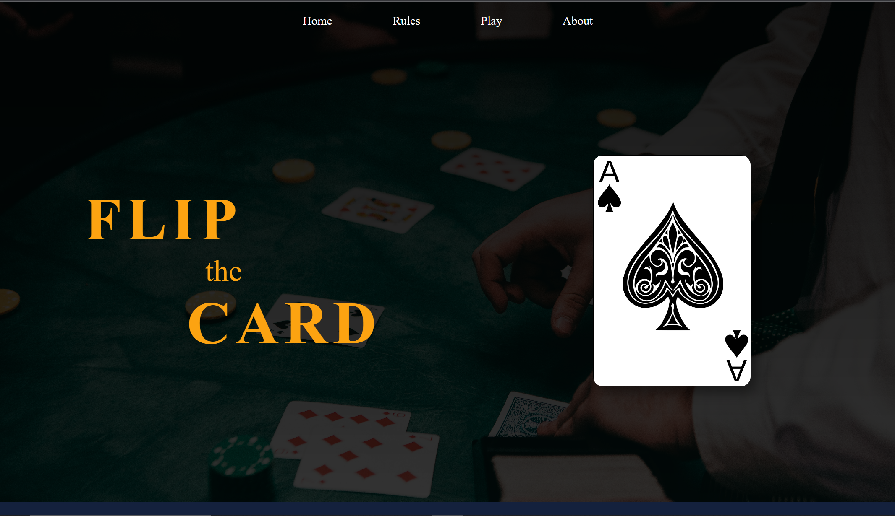
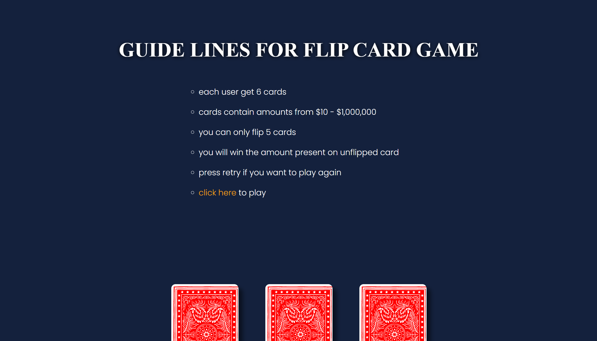
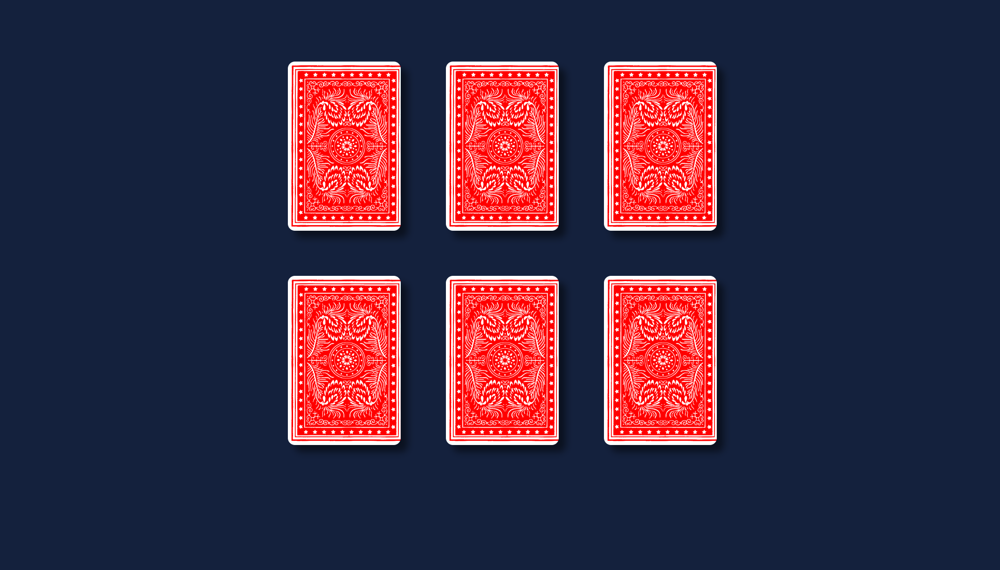
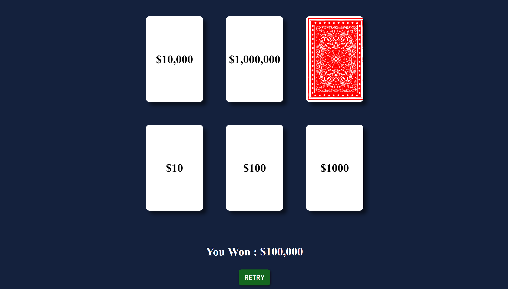

# Flipcard

_It is a game based web application where the user gets 6 cards. Ecah card have a number written on the backside such that a user can flip any 5 out of 6 cards and the user win the points present on unflipped card._

[[click here to visit site](https://iammadhanmohan.github.io/flipcard/ "flipCard")]

**some of the features of the project**

> Responive UI

> Randomize Points

> Handling Click Events

> CSS Animations

<!-- ### Tools & Technologies -->

_Editor:_

- VS Code

_Technologies:_

- HTML
- CSS
- JavaScript

### Screen Shots

